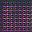

# 🎭 Fake Human Image Generation using GANs

This project implements a **Deep Convolutional Generative Adversarial Network (DCGAN)** to generate realistic-looking synthetic human faces from scratch using TensorFlow and Keras.

## 📌 Project Overview

The goal is to generate fake human face images by training a GAN model on a dataset of real faces. The project includes a custom **generator** and **discriminator**, and performs adversarial training using normalized 32x32 RGB images.

Generated samples are saved per epoch for visual tracking and evaluation.

---

## 🛠️ Tech Stack

- **Language:** Python  
- **Frameworks:** TensorFlow 2.x, Keras  
- **Tools:** Google Colab, OpenCV, NumPy, Matplotlib  
- **Data:** Image dataset in `img/` directory (structured for `image_dataset_from_directory`)

---

## 🧠 Model Architecture

### Generator:
- Fully connected + reshaped input
- Transposed convolutions with BatchNorm and LeakyReLU
- Output: 32x32x3 synthetic RGB face

### Discriminator:
- Convolutional layers with LeakyReLU and Dropout
- Sigmoid output layer for binary classification (real vs. fake)

---

## 📂 Project Structure

.
├── img/ # Directory containing training images
├── generate_face/ # Folder where generated face outputs are saved
├── main.py # Contains full model, training, and image generation code

---

## 🚀 How to Run

1. Clone the repo or upload the script to Google Colab
2. Place your training images in a folder named `img/`
3. Run `main.py` or run cells in order (if in notebook format)
4. Generated face samples will be saved to `generate_face/`

---

## 📸 Output Samples

During training, synthetic face images are generated and saved after selected epochs. Example:

 <!-- Replace with actual image link if hosted -->

---

## 🔍 Key Functions

- `discriminator_model()`: Builds the discriminator
- `generator_model(z_dim)`: Builds the generator
- `train_discriminator()`, `train_generator()`: Train the respective networks
- `generate_and_save_images()`: Generate and save output samples

---

## ✅ Future Improvements

- Increase resolution to 64x64 or 128x128
- Add evaluation metrics (FID, Inception Score)
- Train with CelebA dataset for better realism
- Use Conditional GAN (cGAN) to generate based on attributes

---

## 📄 License

This project is for academic and research purposes only. Generated images are not of real individuals.

---

## 🙌 Acknowledgments

Inspired by the DCGAN architecture proposed by [Radford et al. (2015)](https://arxiv.org/abs/1511.06434) and the CelebA dataset.

